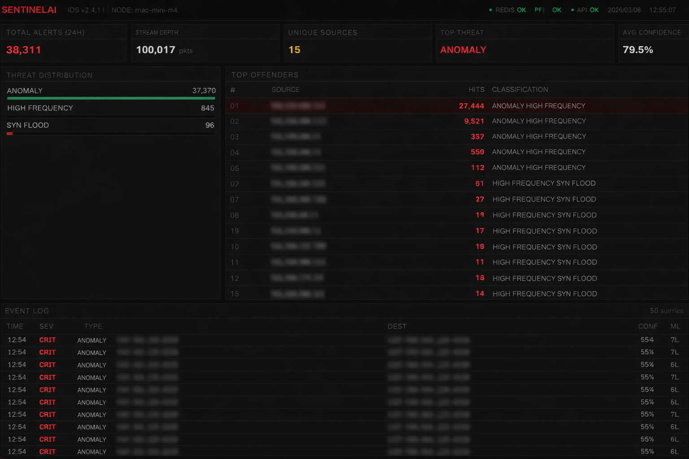

# SentinelAI

Real-time network intrusion detection system with rule-based and ML anomaly detection.

SentinelAI captures live network traffic, extracts flow-level features, runs them through a detection engine, and surfaces threats on a monitoring dashboard. It is designed to run continuously on a local machine or server.

## Dashboard



## Architecture

```
Network Interface
       |
Packet Capture (Scapy)
       |
Redis Stream
       |
Traffic Analyzer
       |
Detection Engine
  |          |
Rules    Isolation Forest
       |
PostgreSQL
       |
FastAPI ──── Next.js Dashboard
```

**Capture Service** — sniffs raw packets from a network interface using Scapy and publishes metadata to a Redis Stream.

**Analyzer** — consumes the stream, tracks bidirectional flows, and extracts statistical features (packet rate, byte rate, SYN ratio, port diversity, etc).

**Detection Engine** — evaluates features against rule-based signatures (SYN flood, port scan, high frequency, large payload) and an optional Isolation Forest anomaly model.

**Alert Service** — persists detected threats to PostgreSQL and logs them to stdout.

**Dashboard API** — FastAPI server exposing alert data, traffic stats, and top offenders.

**Dashboard UI** — Next.js monitoring interface with live polling.

## Requirements

- Docker and Docker Compose
- Python 3.12+ (for packet capture)
- Root/sudo access (for raw socket packet capture)

## Quick Start

```bash
git clone https://github.com/YOUR_USERNAME/sentinel-ai-ids.git
cd sentinel-ai-ids

# Start infrastructure + dashboard
./scripts/start.sh

# Start packet capture (separate terminal, requires sudo)
# Replace en0 with your network interface
sudo python3 capture_service/capture.py
```

The dashboard is available at **http://localhost:3001**.

## Setup

### 1. Configure

```bash
cp .env.example .env
```

Edit `.env` and set `CAPTURE_INTERFACE` to your network interface:

| OS    | Command              | Common interfaces       |
|-------|----------------------|------------------------|
| macOS | `networksetup -listallhardwareports` | `en0` (Wi-Fi), `en1` (Ethernet) |
| Linux | `ip link show`       | `eth0`, `wlan0`, `enp3s0` |

### 2. Start Services

```bash
# Using Docker Compose
cd docker && docker compose up -d

# Or using Make
make up
```

This starts Redis, PostgreSQL, the analyzer, the API, and the dashboard.

### 3. Start Packet Capture

The capture service needs raw socket access and runs on the host machine:

```bash
# With a virtual environment
python3 -m venv .venv
.venv/bin/pip install -r requirements.txt
sudo .venv/bin/python capture_service/capture.py

# Or directly
sudo pip install -r requirements.txt
sudo python3 capture_service/capture.py
```

### 4. Open the Dashboard

- **Dashboard**: http://localhost:3001
- **API**: http://localhost:8000
- **API Docs**: http://localhost:8000/docs

## Testing Without Root Access

A traffic simulator is included for testing the detection pipeline without packet capture:

```bash
python scripts/simulate_attack.py
```

This injects synthetic SYN floods and port scans into the Redis stream.

## Training the Anomaly Model

The ML model is optional. Without it, only rule-based detection runs.

To train on your network's baseline traffic:

```bash
# Step 1: Collect normal traffic (run for at least 30 minutes)
python ml-models/train_model.py --collect 1800

# Step 2: Train the model
python ml-models/train_model.py --train
```

Restart the analyzer after training to load the new model.

## Detection Rules

| Rule           | Condition                                    |
|----------------|----------------------------------------------|
| SYN_FLOOD      | SYN ratio > 80% and packet rate > 50/s       |
| PORT_SCAN      | More than 20 unique destination ports in flow |
| HIGH_FREQUENCY | Packet rate > 200/s                          |
| LARGE_PAYLOAD  | Single packet > 10,000 bytes                 |
| ANOMALY        | Isolation Forest outlier (if model trained)   |

## Project Structure

```
sentinel-ai-ids/
  capture_service/     Packet sniffing and Redis publishing
  analysis_service/    Flow tracking and feature extraction
  detection_engine/    Rule engine and anomaly model
  alert_service/       Alert storage and logging
  dashboard-api/       FastAPI REST endpoints
  dashboard/           Next.js monitoring UI
  ml-models/           Model training scripts
  database/            PostgreSQL schema
  docker/              Dockerfiles and compose config
  scripts/             Startup and testing utilities
```

## API Endpoints

| Endpoint          | Description                        |
|-------------------|------------------------------------|
| `GET /health`     | Service health check               |
| `GET /alerts`     | Recent alerts with filtering       |
| `GET /alerts/summary` | Alert counts grouped by type  |
| `GET /top-ips`    | Top source IPs by alert count      |
| `GET /traffic/live` | Redis stream statistics          |

## License

MIT
