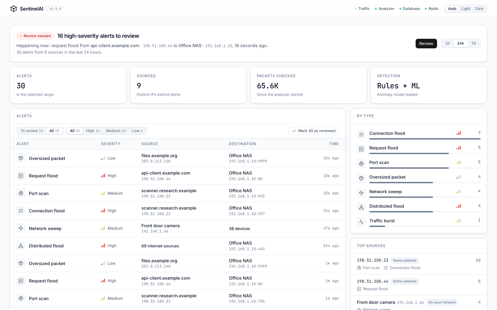
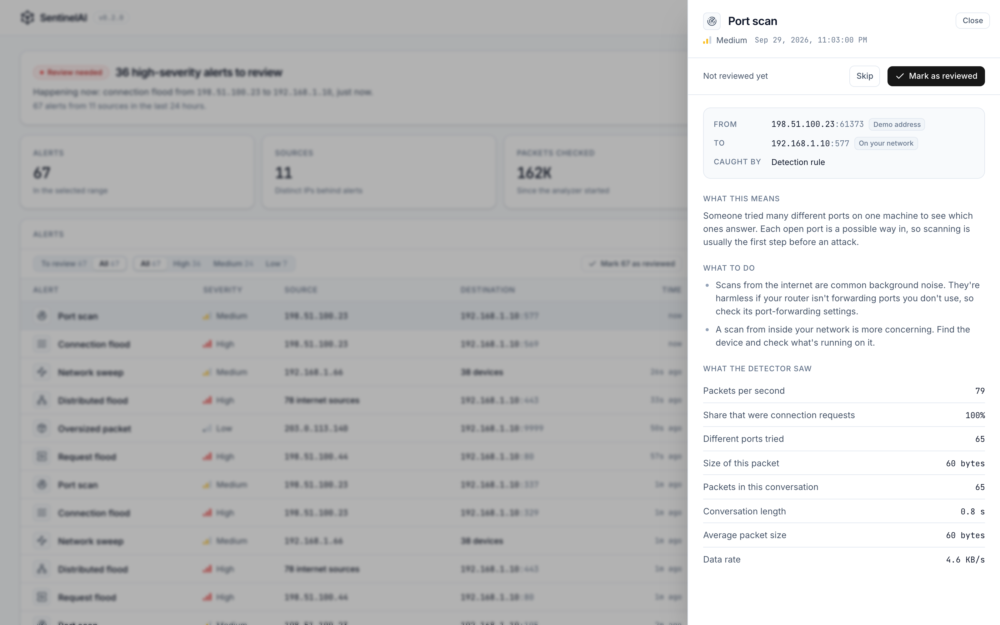

# SentinelAI

[](https://github.com/smngvlkz/sentinel/actions/workflows/ci.yml)
[](LICENSE)

A network intrusion detection system for your home or small-office network.
It watches traffic in real time, spots common attacks such as port scans and
connection floods, and explains what it found in plain language.
Website: [sentinelids.com](https://sentinelids.com).



- **Rule-based detection** for port scans, network sweeps, connection and request floods, distributed floods, traffic bursts and oversized packets, plus an optional rule for botnet check-ins.
- **Optional machine-learning model** (Isolation Forest) that learns your network's normal traffic and flags what doesn't fit.
- **A dashboard that explains itself.** Every alert says what happened, whether the source is on your network or the internet, and what to do next.
- **Runs locally.** Your traffic never leaves your machine, and every service listens only on `127.0.0.1`.

> [!IMPORTANT]
> **Only monitor networks you own or have explicit permission to monitor.**
> Capturing other people's traffic without consent is illegal in many countries.
> SentinelAI is a learning and home-lab tool. It is not a replacement for a
> professional security product.

## Try it in two minutes

You need [Docker](https://docs.docker.com/get-docker/) and `make`. No root access is needed.

```bash
git clone https://github.com/smngvlkz/sentinel.git
cd sentinel
make demo
```

Open **http://localhost:3001**. A simulator replays seven attacks every
minute (a connection flood, a port scan, a request flood, a distributed flood,
a network sweep, an oversized packet and a traffic burst), and you'll see them
detected within seconds. The simulated attackers on the internet use the IP
ranges reserved for documentation (`203.0.113.0/24`, `198.51.100.0/24`), so
they can never be confused with real hosts. The demo turns on hostname
learning and gives them made-up names on the reserved `.example` domains, so
you can see how named alerts look. The simulated devices on your
network use `192.168.1.x` addresses, which may overlap with real ones on your
network, so run the demo on its own rather than alongside real capture.

The bar at the top only asks for attention while there are **unreviewed**
alerts. Once you've looked at an alert, mark it as reviewed (one at a time
from its detail panel, or in bulk from the table) and the dashboard settles
back to calm.

Select any alert to see what it means:



When you're done, stop the fake traffic with `make demo-stop`, or stop
everything with `make down`.

## Watch your real network

Packet capture reads raw network traffic, so it runs on your machine (not in
Docker) and needs `sudo`. You'll also need Python 3.12 or newer.

```bash
make setup     # creates .env and a Python virtual environment
```

Set `CAPTURE_INTERFACE` in `.env` to the interface you want to watch:

| OS    | Find your interfaces                  | Common names              |
|-------|---------------------------------------|---------------------------|
| macOS | `networksetup -listallhardwareports`  | `en0` (Wi-Fi), `en1`      |
| Linux | `ip link show`                        | `eth0`, `wlan0`, `enp3s0` |

Then start the services and capture:

```bash
make up        # Redis, Postgres, analyzer, API and dashboard
make capture   # in a second terminal; asks for your password
```

If you ran the demo first, the demo alerts stay in the history. Run
`make clean` first if you want a fresh start.

On macOS, `make install-launchd` sets up capture to start automatically at boot.

## Commands

Run `make` on its own to print this list.

| Command | What it does |
|---------|--------------|
| `make demo` | Start everything with simulated attacks (no root needed) |
| `make demo-stop` | Stop the simulated traffic, leave the dashboard running |
| `make setup` | First-time setup: `.env` and a Python virtual environment |
| `make up` | Start Redis, Postgres, analyzer, API and dashboard (rebuilds if code changed) |
| `make capture` | Capture live packets from `CAPTURE_INTERFACE` (asks for sudo) |
| `make down` | Stop all services |
| `make restart` | Restart the analyzer, after editing `config/detection.toml` or training a model |
| `make status` | Show which services are running |
| `make logs` | Follow logs from all services |
| `make build` | Rebuild all images |
| `make train-collect` | Record normal traffic for the anomaly model (Ctrl+C to stop early) |
| `make train-model` | Train the anomaly model on the recording |
| `make install-launchd` | macOS: start capture automatically at boot |
| `make clean` | Stop everything and **delete all stored alerts** and built images |
| `make test` | Run the Python tests |
| `make evaluate` | Check detection quality on a built-in labelled capture |
| `make lint` | Lint Python and the dashboard |
| `make dashboard-dev` | Run the dashboard with hot reload on http://localhost:3000 |

## How it works

```
Network interface
       │
Packet capture (Scapy, on the host)
       │
Redis stream
       │
Analyzer ── tracks each source → destination conversation
       │
Detection engine ── rules + optional Isolation Forest model
       │
Alert manager ── de-duplicates repeats, stores to PostgreSQL
       │
FastAPI ──── Next.js dashboard
```

| Component | What it does |
|-----------|--------------|
| `capture_service/` | Sniffs packets and publishes their headers (never payloads) to a Redis stream. Optional name context can also learn hostnames from DNS answers, cleartext HTTP `Host` headers and the TLS server name (SNI). |
| `analysis_service/` | Groups packets into source → destination flows and computes rates, SYN ratio, port diversity and more. |
| `detection_engine/` | Checks each flow against the rules in `config/detection.toml` and, if trained, the anomaly model. |
| `alert_service/` | Logs and stores alerts. Repeats of the same threat for the same pair are suppressed for a cooldown window, so a flood produces one alert instead of thousands. |
| `dashboard-api/` | Read-only REST API for the dashboard. |
| `dashboard/` | Next.js dashboard. |

## Detection rules

| Alert | Fires when | Default |
|-------|------------|---------|
| Connection flood (`SYN_FLOOD`) | Most packets in a flow are connection requests, arriving fast | > 80% SYN and > 50 packets/s |
| Port scan (`PORT_SCAN`) | One source tries to connect to many ports on one host that never answer | > 20 ports |
| Traffic burst (`HIGH_FREQUENCY`) | A flood of small packets outside an established TCP connection | > 1,000 packets/s, average < 300 bytes |
| Oversized packet (`LARGE_PAYLOAD`) | A packet far larger than any network carries, outside an established TCP connection | > 10,000 bytes |
| Request flood (`REQUEST_FLOOD`) | One source opening completed connections to one service very fast, e.g. an HTTP flood | > 400 in 10 s |
| Distributed flood (`DISTRIBUTED_FLOOD`) | Many internet hosts connecting to one of your devices at once | > 50 sources in 60 s |
| Network sweep (`NETWORK_SWEEP`) | One source contacting many devices on your network on the same port | > 20 devices in 60 s |
| Regular check-ins (`BEACONING`) | A device opening connections to the same internet server throughout the last hour, like malware checking in | **Off by default.** When on: ≥ 30 check-ins in 11 of 12 five-minute slots |
| Unusual traffic (`ANOMALY`) | The ML model scores a flow as an outlier | Only with a trained model |

Rate-based rules wait until a flow has at least 10 packets over 0.1 seconds,
so the first packet of an ordinary connection is never flagged.
Replies from servers you connect to and FTP data connections never count as
a port scan, and large downloads never count as a traffic burst or an
oversized packet. UDP port scans aren't detected yet.

The check-in rule is off by default because everyday software checks in the
same way: on a real laptop over 24 hours it flagged the Cursor editor and the
Claude apps 50 times, and on a CIC-IDS2017 day with no attacks it flagged two
workstations all day. It did catch every infected machine in that dataset, so
turn it on (`enabled = true` under `[beaconing]` in `config/detection.toml`,
then `make restart`) if you'd rather have noisy alerts than miss a bot.

### Tuning

Every threshold lives in [`config/detection.toml`](config/detection.toml).
Edit it and run `make restart`. Busy networks, such as ones with a file server
or big backups, usually need higher rate limits. To keep your settings outside
the repo, point `SENTINEL_CONFIG` at your own copy.

### Hostnames on alerts (optional)

By default SentinelAI only sees IP addresses. To show names like
`api2.cursor.sh` next to an alert IP, turn on optional name context:

1. Set `PAYLOAD_INSPECTION=true` in `.env` and restart capture
   (`make capture`).
2. Set `enabled = true` under `[names]` in `config/detection.toml`, then
   `make restart`.

Capture then learns IP → hostname bindings from DNS answers, cleartext
HTTP `Host` headers and the server name in a TLS handshake (SNI). Each
binding remembers which of your devices used the name, so when one CDN
address serves many sites, an alert shows the site that device was actually
talking to.

The analyzer keeps these names in memory only (capped, forgotten after 24
hours, relearned within minutes after a restart) and stores a name **only on
the alert row** when something fires — not on every packet, and not in a
standing name table. Names are chosen by whoever sent the traffic, so treat
them as helpful context, not proof of identity. Anything that isn't a valid
hostname (letters, digits, dots, hyphens, underscores) is dropped whole,
never cleaned into a different name, and capture logs a count of dropped
names at most once a minute, since a malformed name is itself suspicious.

Modern browsers send TLS handshakes too big for one packet (post-quantum
keys); on a test Mac about one in five server names only arrived in the
second packet. Capture briefly holds the first part of such a handshake,
for at most 2 seconds and within a fixed memory cap, to read the name from
the rest. Replaying 502 real HTTPS connections, that raised the share of
names read from 81% to 99.8%.

Not covered: encrypted DNS (DNS over HTTPS/TLS) and QUIC/HTTP3 (the server
name is inside encrypted packets).

### Naming your devices

Open an alert and click **Name this device** next to any address on your
network, e.g. `192.168.1.20` → `Living room TV`. The name replaces the IP
everywhere in the dashboard, including older alerts, and a learned hostname
still shows on hover. Names are stored by IP address in Postgres, so a
device that gets a new address from your router needs naming again; giving
important devices a fixed address (a DHCP reservation) avoids that. This
works without name context turned on.

## Accuracy

Measured on [CIC-IDS2017](https://www.unb.ca/cic/datasets/ids-2017.html), a
public dataset of real traffic with labelled attacks. Wednesday (13.7 million
packets, five denial-of-service attacks) and Monday (11.6 million packets, no
attacks) were held out: every threshold was frozen before they were
replayed. Friday (9.9 million packets) was partly tuned on, so treat it as
optimistic. Details in [docs/evaluation.md](docs/evaluation.md):

| | Wednesday (held out) | Monday (held out) | Friday (tuned on) |
|---|---|---|---|
| HTTP flood flows caught | **96.7%** (Hulk), 37.8% (GoldenEye) | no attacks | **99.9%** |
| Slow HTTP attacks caught | **0%** (Slowloris), 46.2% (Slowhttptest) | no attacks | none that day |
| Port-scan flows caught | none that day | no attacks | **99.7%** |
| Infected machines flagged by the botnet check-in rule | no botnet that day | no botnet | **5 of 5**, about 45 minutes after they started |
| Normal flows wrongly flagged, check-in rule aside | **0.005%** | **0.008%** | **0.006%** |
| Normal machines with at least one false alarm over the day | 7 of 12 (17 alerts) | 9 of 13 (49 alerts) | 5 of 7 (16 alerts) |

Slow attacks, which hold connections open with very little traffic, and
Heartbleed are missed: no rule looks for them yet.

**The check-in rule is noisy.** On Friday and Wednesday it flagged one
server that polls a service all day (7 and 8 alerts). On Monday it also
flagged two workstations that kept reconnecting to dozens of web services
for hours, most likely web pages refreshing ads and analytics. With the
polling server, that was 34 of Monday's 49 alerts. Friday is the only botnet
day in the dataset, so there's no held-out test of how well it catches bots.
For these reasons the rule is off by default; the numbers above were
measured with it on.

The optional anomaly model adds little detection (two extra flood minutes
on Wednesday), and flagged 0.57% of normal minutes on Friday, 0.01% on
Wednesday and 0.23% on Monday.

Methodology, full results and how to reproduce them:
[docs/evaluation.md](docs/evaluation.md). `make evaluate` runs a built-in
self-test as part of CI.

## Train the anomaly model (optional)

Without a model, only the rules run. The model learns what normal traffic
looks like on your network and flags anything that doesn't fit as
"Unusual traffic". To train it, capture must be running:

```bash
make train-collect   # records up to 1 hour; press Ctrl+C to stop early and keep what's recorded
make train-model     # trains on the recording (takes seconds)
make restart         # the analyzer loads the new model
```

- **Record for at least 20–30 minutes of normal use.** The model flags
  anything it didn't see during recording, so a short recording means lots of
  false "Unusual traffic" alerts.
- **The model judges each connection at most every 5 seconds**, not every
  packet (`judge_interval_seconds` in `config/detection.toml`). That halved
  false alarms on CIC-IDS2017 without missing more attacks.
- **The model only judges conversations with some history** (10 packets over
  0.1 seconds, the same rule the detection rules use). A brand-new
  connection's rate is meaningless and used to be the main source of false
  alarms.
- **Record during a typical period with no known attacks.** Anything in the
  recording is learned as normal.
- **Every connection counts equally.** The recording takes one sample per
  connection every 5 seconds, so a big download running at the same time
  doesn't drown out the rest of your traffic.
- **Each recording replaces the previous one** (`ml-models/data/normal_traffic.json`).

To switch the model off, move `ml-models/saved/anomaly_model.pkl` elsewhere
and run `make restart`. Detection carries on with the rules only.

## Configuration

Settings live in `.env`, which `make setup` creates from [`.env.example`](.env.example).

| Variable | Default | Purpose |
|----------|---------|---------|
| `CAPTURE_INTERFACE` | `en0` | Network interface to capture from |
| `POSTGRES_PASSWORD` | `changeme` | Database password. Change it if anything else can reach your machine. |
| `DASHBOARD_UI_PORT` | `3001` | Dashboard port |
| `DASHBOARD_PORT` | `8000` | API port |
| `ALERT_COOLDOWN_SECONDS` | from `detection.toml` | Overrides the alert de-duplication window |
| `NAMES_ENABLED` | from `detection.toml` | Overrides `[names] enabled` (`make demo` sets it to `true`; its traffic is made up) |
| `SENTINEL_CONFIG` | `config/detection.toml` | Path to a custom detection config |

### Remote access

The API has no authentication, so every port is bound to `127.0.0.1`. To view
the dashboard from another device, use an SSH tunnel
(`ssh -L 3001:localhost:3001 -L 8000:localhost:8000 your-server`) rather than
exposing the ports.

## Troubleshooting

| Symptom | Fix |
|---------|-----|
| Dashboard says it can't reach the API | Run `make status`. If services aren't running, `make up`. |
| "Waiting for network traffic" | Capture isn't running. Start it with `make capture`, or run `make demo`. |
| `make capture` fails with an interface error | `CAPTURE_INTERFACE` in `.env` doesn't match an interface on your machine (see the table above). |
| Normal activity keeps getting flagged | Raise the relevant threshold in `config/detection.toml`, then `make restart`. |
| Lots of "Unusual traffic" alerts | The anomaly model was trained on too little traffic. Record for longer with `make train-collect`, then `make train-model` and `make restart`, or switch the model off (see above). |

## API

The API runs at http://localhost:8000, with interactive docs at `/docs`.

| Endpoint | Returns |
|----------|---------|
| `GET /health` | Status of the database, Redis, capture and analyzer |
| `GET /stats?hours=24` | Alert count, distinct sources, counts by severity, and the most severe unreviewed alert |
| `GET /alerts?hours=24&limit=50` | Recent alerts, filterable by `severity`, `status` (`all`, `unreviewed`, `reviewed`) and `threat_type` |
| `POST /alerts/review` | Mark alerts reviewed or unreviewed: `{"ids": [1, 2]}` or `{"hours": 24, "severity": "high"}`, plus `"reviewed": false` to undo |
| `GET /alerts/summary?hours=24` | Alert counts by type |
| `GET /top-ips?hours=24` | Sources with the most alerts |
| `GET /traffic/live` | Redis stream statistics |

## Contributing

Contributions are welcome. See [CONTRIBUTING.md](CONTRIBUTING.md) to get a
development setup running, and [SECURITY.md](SECURITY.md) to report a
vulnerability privately.

## License

[MIT](LICENSE)
